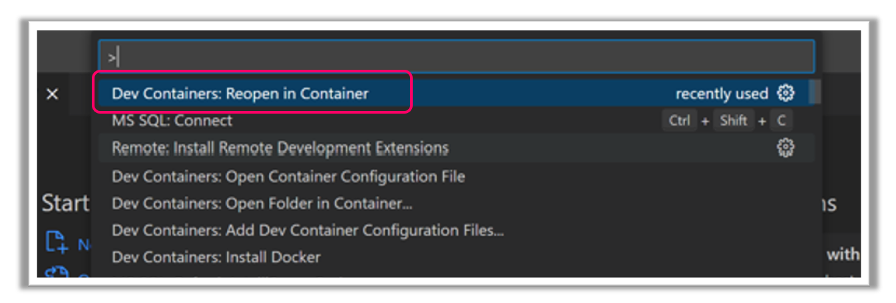
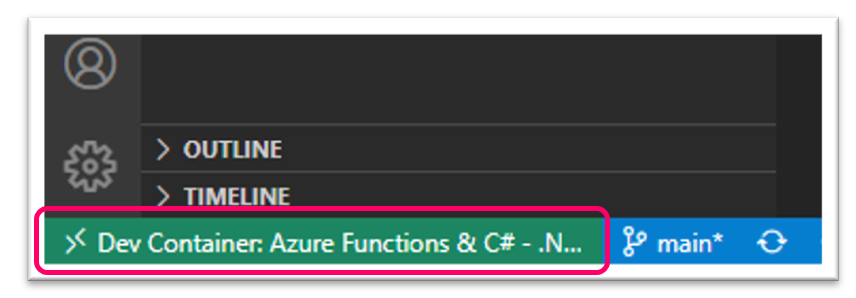

# 4. （上級編）Dev Containersとngrokを使ってローカルデバッグを行う
## 4-1. ローカルデバッグ手順
### Dev Containersを使って開発環境を立ち上げる
まずは、`Docker`を起動した状態(Docker Desktopを使用する場合は、Docker Desktopを起動した状態)にします。  
VSCodeを起動し、左上の「File」→「Open Folder」で`hol-azure-line-bot-functions`フォルダを開きます。  
VSCode上でF1キーからコマンドパレットを起動し、「Dev Containers:Reopen in Container」を選択します。


VSCodeが起動しなおし、コンテナが動いていることが確認できます。


### 設定ファイルを用意し、Functionsをデバッグ起動
`Functions/local.settings.json` ファイルを作成します。  
内容は `Functions/local.settings.json.template` の中身をコピーし、 `LINE_CHANNEL_ACCESS_TOKEN` の値のみご自身のLINE Messaging APIのチャネルアクセストークンに書き換えます。  
（例: `"LINE_CHANNEL_ACCESS_TOKEN": "abcd...xyz="` ）

VSCode上で、追加で新しくターミナルを開きます。  
以下コマンドで `Functions` ディレクトリに移動し、Functionsをデバッグ起動します。

```
cd Functions
func start --csharp
```

下の画像のように、 `Webhook: [POST] http://localhost:7071/api/Webhook` と表示されたらDev Containers上でのFunctionsのデバッグ起動が成功です！


### ngrokを使用したLINE Botとの疎通
ngrokが使用できるターミナルを開き、以下コマンドを実行します。

```
ngrok http 7071
```

このコマンドにより、発行されたngrokのURL（例: `https://1234-567-890.jp.ngrok.io` ）が http://localhost:7071 にトンネリングされます。  
LINE DevelopersコンソールのWebhook URLの設定（『2-3. LINEチャネル作成』参照）に、この発行されたngrokのURLに `/api/Webhook` とつけたもの（例: `https://1234-567-890.jp.ngrok.io/api/Webhook` ）を設定します。


LINEアプリのトークルームでBotにメッセージを送ると、ローカルデバッグしているFunctionsが動作します。  
以上で、Dev Containersを使用したAzure Functionsのローカルデバッグならびに、ngrokを使用したLINE Botからローカルで実行中のAzure Functionsへの疎通手順が完了しました。  
試しに、ローカルのソースコードを変更し、動作確認してみてください。

## 4-2. 参考資料
### Azure Functionsのトリガーとバインド  
ハンズオンの2章でAzure Functionsを使用しました。  
トリガーとバインドに関する概念をここで詳しく説明しています。  
[AzureFunctionsのトリガーとバインドの概念](https://learn.microsoft.com/ja-jp/azure/azure-functions/functions-triggers-bindings?tabs=csharp)

### LINE Messaging APIのWebhookイベント  
ハンズオンの2章でWebhookイベントを使用しました。  
Webhookに関して詳しくここで説明しています。  
[LINE Messaging APIのWebhookイベント（テキストメッセージ）](https://developers.line.biz/ja/reference/messaging-api/#wh-text)

また、Messaging APIの概要や仕組みについてのドキュメントもありますので、何ができるのかぜひ見てみましょう。  
[Messaging APIの概要](https://developers.line.biz/ja/docs/messaging-api/overview/)
