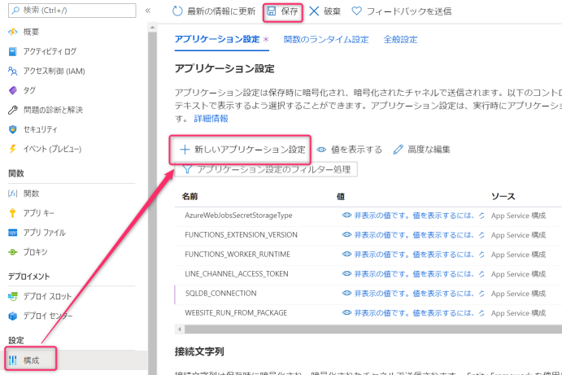

# 4. Functionsの更新
## 4-1. アプリケーション設定にDB接続文字列を追加
Functionsのリソースへ移動し、アプリケーション設定にSQLDB接続文字列を `SQLDB_CONNECTION` として追加します。  
前ステップにて作成したSQLDB接続文字列を使用してください。  

 

## 4-2. ソースコードの変更
VSCodeのターミナルを開き、 `Functions` ディレクトリに移動します。  
下記コマンドを実行し、 `System.Data.SqlClient` パッケージをプロジェクトに追加します。

```bash
dotnet add package System.Data.SqlClient -v 4.8.2
```

`Webhook.cs` を開き、処理を追加します。  
usingに `System.Data.SqlClient` と `ApplicationCore.Entities` を追加します。

```csharp
using System.Data.SqlClient;
using ApplicationCore.Entities;
```

DB接続文字列をフィールドに追加し、コンストラクタ内で初期化します。

```csharp
private readonly IHttpClientFactory httpClientFactory;
private readonly string accessToken;
private readonly string sqldbConnection; // 追加

public Webhook(
    IHttpClientFactory httpClientFactory,
    IConfiguration configuration)
{
    this.httpClientFactory = httpClientFactory;
    accessToken = configuration.GetValue<string>("LINE_CHANNEL_ACCESS_TOKEN");
    sqldbConnection = configuration.GetValue<string>("SQLDB_CONNECTION"); // 追加
}
```

GetMessage関数をWebhookクラス内に追加します。

```csharp
/// <summary>
/// DBからメッセージデータを取得
/// </summary>
/// <returns>取得したメッセージデータ</returns>
private Message GetMessage()
{
    var message = default(Message);
    using (var connection = new SqlConnection(sqldbConnection))
    {
        connection.Open();
        using (var command = connection.CreateCommand())
        {
            // 1件のみ取得
            command.CommandText = "SELECT TOP 1 * FROM Message;";
            using (var reader = command.ExecuteReader())
            {
                if (reader.Read())
                {
                    message = new Message
                    {
                        Id = reader["Id"] as Guid? ?? Guid.Empty,
                        Text = reader["Text"] as string,
                    };
                }
            }
        }
    }

    if (message == null || message.Id == Guid.Empty)
    {
        return null;
    }

    return message;
}
```

GetMessage関数を使用して返信内容を取得するよう、Run関数内を変更します。

```csharp
// ----- コメントアウト -----
// オウム返しする
//await Reply(firstEvent.ReplyToken, firstEvent.Message.Text);
// ----------

// DBからメッセージデータを取得
var message = GetMessage();

// DBからメッセージデータが取得できれば取得したテキストを返信、なければオウム返し
var text = message?.Text ?? firstEvent.Message.Text;
await Reply(firstEvent.ReplyToken, text);
```

## 4-3. 再度デプロイ・動作確認
手順「Functionsの作成 > デプロイ」で行ったものと同様の手順で再度デプロイします。  
  
LINEを開き、メッセージ送信後にWeb画面で登録した文言が返信されることを確認します。

## 【応用】テキスト以外のメッセージの送信
今回のハンズオンでは、LINE Messaging APIのうち「応答メッセージ」のAPIを使用しています。  
応答メッセージのドキュメント↓  
https://developers.line.biz/ja/reference/messaging-api/#send-reply-message  
  
このAPIでは、テキスト以外の形式のメッセージを送信することも可能です。  
例えば、↓ドキュメントではスタンプを送信する際に使用するJSONの形式が記載されています。  
https://developers.line.biz/ja/reference/messaging-api/#sticker-message  
  
今回のソースコードでは下記の箇所でJSON文字列を生成しています。  
この部分を変更し、送信するテキスト内容を変更したり、テキスト以外の形式でメッセージ送信を行ってみましょう。  
https://github.com/alterbooth/hol-azure-line-bot/blob/main/Functions/Webhook.cs#L73-L78
