# Webアプリの更新
このテキストではデプロイしたWebアプリのコードを書き加えて、メッセージの作成、更新、削除が行えるようにします。
## DBマイグレーション準備
コードを書く前にデータベースの準備をします。
データのやりとりができるようにデータベースをAzure上に構築します。
### SQL Databaseリソース追加

1. [SQL デプロイ オプションの選択](https://portal.azure.com/#create/Microsoft.AzureSQL)
ページを参照します。
2. [SQL データベース] で、 [リソースの種類] を [単一データベース] に設定し、 [作成] を選択します。

3. [SQL データベースの作成] フォームの [基本] タブにある [プロジェクトの詳細] で、目的の Azure [サブスクリプション] を選択します。
4. [リソース グループ] で、 [タブ] を開き、ハンズオンで使用しているリソースグループを、 選択します。
5. [データベース名] に任意のデータベース名を入力します。  
6. [サーバー] で、 [新規作成] を選択し、 [新しいサーバー] フォームに次の値を入力します。
   -  [サーバー名] : 「hoi-line-bot-db-」と入力し、一意にするためにいくつかの文字を追加します。 サーバー名は、サブスクリプション内で一意ではなく、Azure のすべてのサーバーに対してグローバルに一意である必要があるため、正確なサーバー名をここに示すことはできません。 hoi-line-bot-db-12345 のように入力してから、利用可能かどうかをポータルで確認できます。
   - サーバー管理者ログイン:「azureuser」と入力します。
   - パスワード:要件を満たすパスワード(例:Passw0rd!)を入力し、 [パスワードの確認入力] フィールドにもう一度入力します。
   - [場所] :ドロップダウン リストから東日本を選択します。
   - [OK] を選択します。
   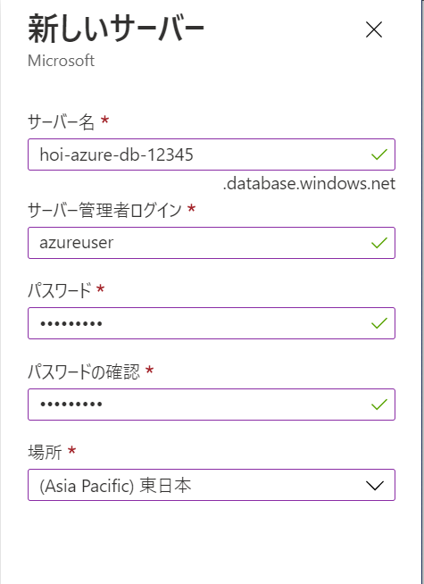

7. [SQL エラスティック プールを使用しますか?] を [いいえ] に設定したままにします。
8. [コンピューティングとストレージ] で、 [データベースの構成] を選択します。
9. ハンズオンでは[サーバーレス] を選択します。
10.  [自動一時停止の遅延]で[2時間]に設定し[適用] を選択します。

11.  ページの下部にある [次へ: ネットワーク]を選択します。

12.  [ネットワーク] タブの [接続方法] で、 [パブリック エンドポイント] を選択します。
13.  [ファイアウォール規則] で、 [現在のクライアント IP アドレスを追加する] を [はい] に設定します。 [Azure サービスおよびリソースにこのサーバー グループへのアクセスを許可する] を [はい] に設定します。
14.  ページの下部にある  [確認と作成] を選択します。
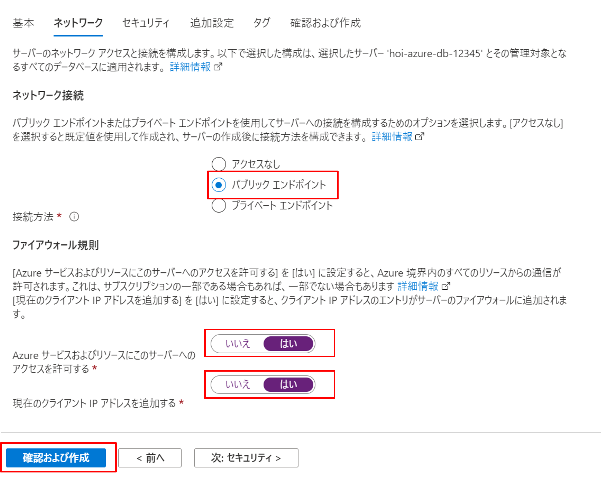
15.  [確認と作成] ページで、確認後、 [作成] を選択します。

### データベース接続文字列の取得
1.  デプロイが完了したら、「リソースに移動]を選択します。
2.  画面右の[データベース接続文字列の表示]を選択します。
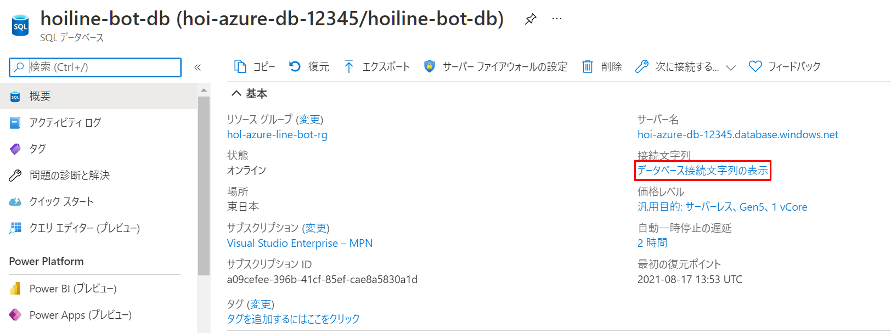
3.  画面に表示された接続文字列をメモ帳などに控えます。
4.  接続文字列の途中にある[{your_password}]をサーバー作成時に設定したパスワードに書き換えます。(例:Pasword='Passw0rd!')
### appsettings.jsonにDB接続文字列の追加
Webフォルダ直下にあるappsettings.jsonの[WebContext]の値を先ほど控えた接続文字列に置き換えます。
```appsettings.json
"ConnectionStrings": {
    "WebContext": "{Azure上のDBの接続文字列}"
  }
```
次のセクションではコードでマイグレーションの準備を行います。
### WebContext.csを追加
Webフォルダ直下に[Data]フォルダを作成し、[WebContext.cs]を[Data]フォルダに追加します。
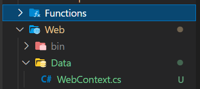  
[WebContext.cs]に以下のコードを追加します。
```WebContext.cs
using System;
using System.Collections.Generic;
using System.Linq;
using System.Threading.Tasks;
using Microsoft.EntityFrameworkCore;
using ApplicationCore.Entities;

namespace Web.Data
{
    public class WebContext : DbContext
    {
        public WebContext (DbContextOptions<WebContext> options)
            : base(options)
        {
        }

        public DbSet<ApplicationCore.Entities.Message> Message { get; set; }
    }
}
```
### StartUp.csにコード追加
Webアプリとデータベースが接続できるように、 [StartUp.cs]に次のコードを追加します。
```StartUp.cs
public void ConfigureServices(IServiceCollection services)
{
    services.AddRazorPages();

    // ↓を追加する
    services.AddDbContext<WebContext>(options =>
            options.UseSqlServer(Configuration.GetConnectionString("WebContext")));
}
```
### マイグレーションツールのインストール
マイグレーションはEntity Framework CoreのCLIツールを使用します。このツールでデータベースの移行作業をを行うことができます。次のコマンドでツールのインストールします。
```bash
dotnet tool install --global dotnet-ef
```
次のコマンドを実行して EF Core CLI ツールが正しくインストールされていることを確認します。
```bash
dotnet ef
```
正常にインストールされていたら、インストール完了です。
## マイグレーションの実行
次のコマンドを実行してマイグレーションを行います。
```bash
cd ./Web
dotbet build
dotnet ef migrations add InitialCreate
dotnet ef database update
```

成功するとAzure上で正常にDBが作成されていることが確認できます。
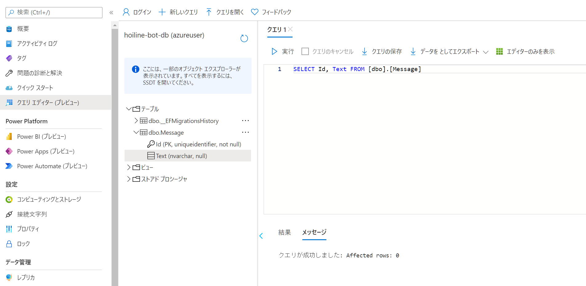
## コードの変更
メッセージの作成、更新、削除を行えるようにコードを追加します。
### Createページを追加
作成ページを追加します。
1. [Pages/hands_on]フォルダ直下に[Create.cshtml]と[Create.cshtml.cs]を追加します。  
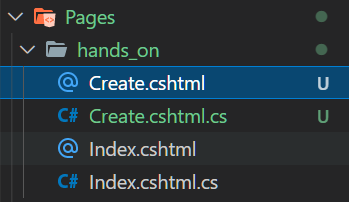
```Create.cshtml
@page
@model Web.Pages.hands_on.CreateModel

@{
    ViewData["Title"] = "Create";
}

<h1>Create</h1>

<h4>Message</h4>
<hr />
<div class="row">
    <div class="col-md-4">
        <form method="post">
            <div asp-validation-summary="ModelOnly" class="text-danger"></div>
            <div class="form-group">
                <label asp-for="Message.Text" class="control-label"></label>
                <input asp-for="Message.Text" class="form-control" />
                <span asp-validation-for="Message.Text" class="text-danger"></span>
            </div>
            <div class="form-group">
                <input type="submit" value="Create" class="btn btn-primary" />
            </div>
        </form>
    </div>
</div>

<div>
    <a asp-page="Index">Back to List</a>
</div>

@section Scripts {
    @{await Html.RenderPartialAsync("_ValidationScriptsPartial");}
}
```
```Create.cshtml.cs
using System;
using System.Collections.Generic;
using System.Linq;
using System.Threading.Tasks;
using Microsoft.AspNetCore.Mvc;
using Microsoft.AspNetCore.Mvc.RazorPages;
using Microsoft.AspNetCore.Mvc.Rendering;
using ApplicationCore.Entities;
using Web.Data;

namespace Web.Pages.hands_on
{
    public class CreateModel : PageModel
    {
        private readonly Web.Data.WebContext _context;

        public CreateModel(Web.Data.WebContext context)
        {
            _context = context;
        }

        public IActionResult OnGet()
        {
            return Page();
        }

        [BindProperty]
        public Message Message { get; set; }

        // To protect from overposting attacks, enable the specific properties you want to bind to, for
        // more details, see https://aka.ms/RazorPagesCRUD.
        public async Task<IActionResult> OnPostAsync()
        {
            if (!ModelState.IsValid)
            {
                return Page();
            }

            _context.Message.Add(Message);
            await _context.SaveChangesAsync();

            return RedirectToPage("./Index");
        }
    }
}
```
2. [Index.cshtml.cs]に表示処理を追加します。
```Index.cshtml.cs
using System;
using System.Collections.Generic;
using System.Linq;
using System.Threading.Tasks;
using Microsoft.AspNetCore.Mvc;
using Microsoft.AspNetCore.Mvc.RazorPages;
using Microsoft.EntityFrameworkCore;
using ApplicationCore.Entities;
using Web.Data;

namespace Web.Pages.hands_on
{
    public class IndexModel : PageModel
    {
        private readonly Web.Data.WebContext _context;

        public IndexModel(Web.Data.WebContext context)
        {
            _context = context;
        }

        public IList<Message> Message { get;set; }

        public async Task OnGetAsync()
        {
            Message = await _context.Message.ToListAsync();
        }
    }
}
```
3. [Index.cshtml]を編集してメッセージが表示できるようにします。
```Index.cshtml
<table class="table">
    <thead>
        <tr>
            <th>
                @Html.DisplayNameFor(model => model.Message[0].Text)
            </th>
        </tr>
    </thead>
    <tbody>
    @foreach (var item in Model.Message) {
        <tr>
            <td>
                @Html.DisplayFor(modelItem => item.Text)
            </td>
        </tr>
    }
    </tbody>
</table>
```
4. [Web]を起動して、メッセージが作成できることを確認します。


### Deleteページを追加
削除ページを追加します。
1. [Pages/hands_on]フォルダ直下に[Delete.cshtml]と[Delete.cshtml.cs]を追加します。  
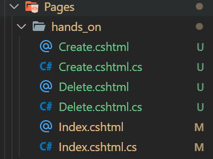

```Delete.cshtml
@page
@model Web.Pages.hands_on.DeleteModel

@{
    ViewData["Title"] = "Delete";
}

<h1>Delete</h1>

<h3>Are you sure you want to delete this?</h3>
<div>
    <h4>Message</h4>
    <hr />
    <dl class="row">
        <dt class="col-sm-2">
            @Html.DisplayNameFor(model => model.Message.Text)
        </dt>
        <dd class="col-sm-10">
            @Html.DisplayFor(model => model.Message.Text)
        </dd>
    </dl>
    
    <form method="post">
        <input type="hidden" asp-for="Message.Id" />
        <input type="submit" value="Delete" class="btn btn-danger" /> |
        <a asp-page="./Index">Back to List</a>
    </form>
</div>
```
```Delete.cshtml.cs
using System;
using System.Collections.Generic;
using System.Linq;
using System.Threading.Tasks;
using Microsoft.AspNetCore.Mvc;
using Microsoft.AspNetCore.Mvc.RazorPages;
using Microsoft.EntityFrameworkCore;
using ApplicationCore.Entities;
using Web.Data;

namespace Web.Pages.hands_on
{
    public class DeleteModel : PageModel
    {
        private readonly Web.Data.WebContext _context;

        public DeleteModel(Web.Data.WebContext context)
        {
            _context = context;
        }

        [BindProperty]
        public Message Message { get; set; }

        public async Task<IActionResult> OnGetAsync(Guid? id)
        {
            if (id == null)
            {
                return NotFound();
            }

            Message = await _context.Message.FirstOrDefaultAsync(m => m.Id == id);

            if (Message == null)
            {
                return NotFound();
            }
            return Page();
        }

        public async Task<IActionResult> OnPostAsync(Guid? id)
        {
            if (id == null)
            {
                return NotFound();
            }

            Message = await _context.Message.FindAsync(id);

            if (Message != null)
            {
                _context.Message.Remove(Message);
                await _context.SaveChangesAsync();
            }

            return RedirectToPage("./Index");
        }
    }
}
```
2. Index ページに削除ボタンを追加します。
```index.cshtml
<table class="table">
    <thead>
        <tr>
            <th>
                @Html.DisplayNameFor(model => model.Message[0].Text)
            </th>
            <!-- thを追加 -->
            <th></th>
        </tr>
    </thead>
    <tbody>
@foreach (var item in Model.Message) {
        <tr>
            <td>
                @Html.DisplayFor(modelItem => item.Text)
            </td>
            <!-- ボタンを追加 -->
            <td>
                <a asp-page="./Delete" asp-route-id="@item.Id">Delete</a>
            </td>
        </tr>
}
    </tbody>
</table>
```
3. Webを再起動して、削除が動作することを確認します。
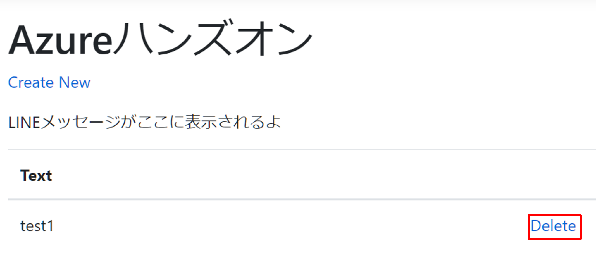
### Editページを追加
編集ページを追加します。
1. [Pages/hands_on]フォルダ直下に[Edit.cshtml]と[Edit.cshtml.cs]を追加します。  

```Edit.cshtml
@page
@model Web.Pages.hands_on.EditModel

@{
    ViewData["Title"] = "Edit";
}

<h1>Edit</h1>

<h4>Message</h4>
<hr />
<div class="row">
    <div class="col-md-4">
        <form method="post">
            <div asp-validation-summary="ModelOnly" class="text-danger"></div>
            <input type="hidden" asp-for="Message.Id" />
            <div class="form-group">
                <label asp-for="Message.Text" class="control-label"></label>
                <input asp-for="Message.Text" class="form-control" />
                <span asp-validation-for="Message.Text" class="text-danger"></span>
            </div>
            <div class="form-group">
                <input type="submit" value="Save" class="btn btn-primary" />
            </div>
        </form>
    </div>
</div>

<div>
    <a asp-page="./Index">Back to List</a>
</div>

@section Scripts {
    @{await Html.RenderPartialAsync("_ValidationScriptsPartial");}
}
```
```Edit.cshtml.cs
using System;
using System.Collections.Generic;
using System.Linq;
using System.Threading.Tasks;
using Microsoft.AspNetCore.Mvc;
using Microsoft.AspNetCore.Mvc.RazorPages;
using Microsoft.AspNetCore.Mvc.Rendering;
using Microsoft.EntityFrameworkCore;
using ApplicationCore.Entities;
using Web.Data;

namespace Web.Pages.hands_on
{
    public class EditModel : PageModel
    {
        private readonly Web.Data.WebContext _context;

        public EditModel(Web.Data.WebContext context)
        {
            _context = context;
        }

        [BindProperty]
        public Message Message { get; set; }

        public async Task<IActionResult> OnGetAsync(Guid? id)
        {
            if (id == null)
            {
                return NotFound();
            }

            Message = await _context.Message.FirstOrDefaultAsync(m => m.Id == id);

            if (Message == null)
            {
                return NotFound();
            }
            return Page();
        }

        // To protect from overposting attacks, enable the specific properties you want to bind to, for
        // more details, see https://aka.ms/RazorPagesCRUD.
        public async Task<IActionResult> OnPostAsync()
        {
            if (!ModelState.IsValid)
            {
                return Page();
            }

            _context.Attach(Message).State = EntityState.Modified;

            try
            {
                await _context.SaveChangesAsync();
            }
            catch (DbUpdateConcurrencyException)
            {
                if (!MessageExists(Message.Id))
                {
                    return NotFound();
                }
                else
                {
                    throw;
                }
            }

            return RedirectToPage("./Index");
        }

        private bool MessageExists(Guid id)
        {
            return _context.Message.Any(e => e.Id == id);
        }
    }
}
```
2. Index ページに編集ボタンを追加します。
```Index.cshtml
<td>
    <a asp-page="./Edit" asp-route-id="@item.Id">Edit</a> |
    <a asp-page="./Delete" asp-route-id="@item.Id">Delete</a>
</td>
```
3. Webを再起動して、編集が動作することを確認します。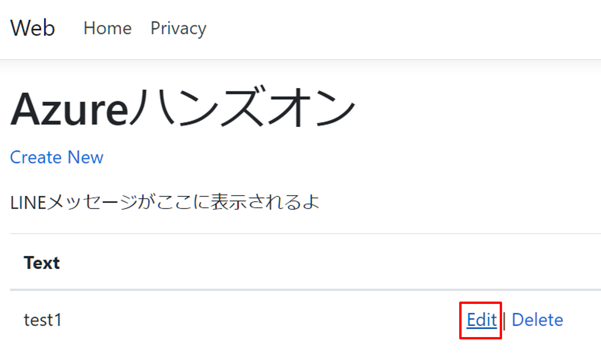

## 再度デプロイ
### Web Appsの接続文字列の設定
Web AppsからDBに接続するために、作成したWeb Appsリソースの[アプリケーション設定]を行います。
1. [Azure Portal](https://portal.azure.com/#home)を開き、画面上部の検索に[azure-handson-app]と入力し、表示された[azure-handson-app]を選択します。
2. ページ右側の[設定]>[構成]を選択します。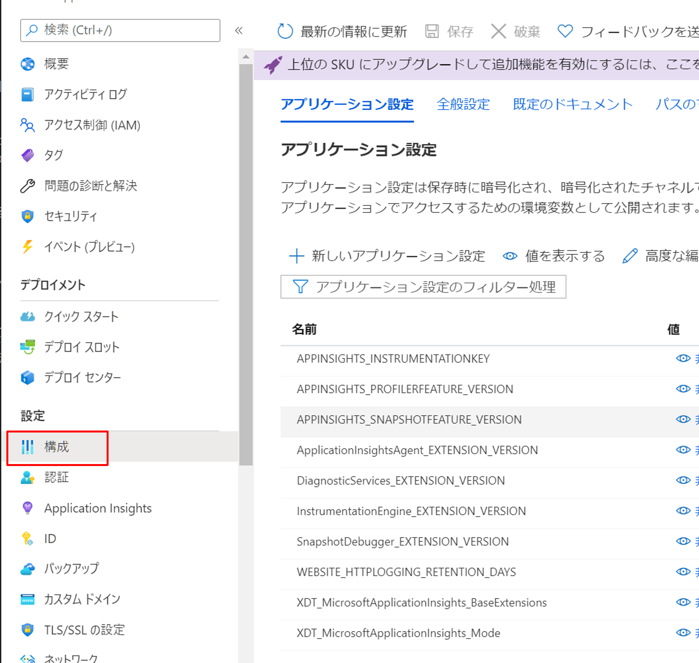
3. ページ下部の[新しい接続文字列]を選択します。
   - [名前]に[WebContext]と入力します。
   - [値]に控えてた[データベース接続文字列]を入力します。
   - [種類]は[SQL Server]を選択します。 
   - [OK]を選択します。
   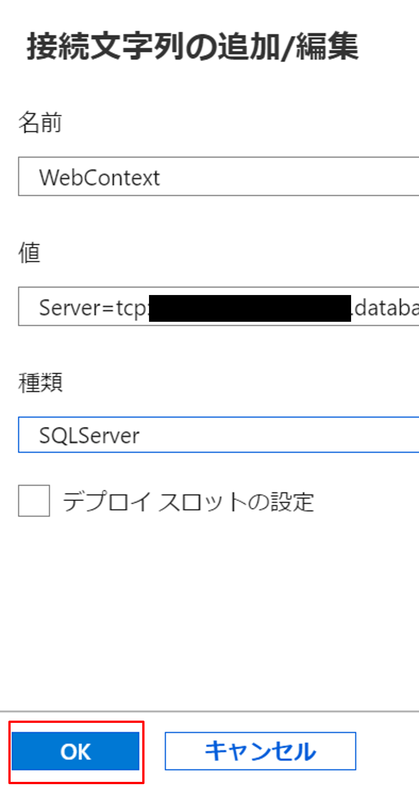
4. ページ上部の[保存]を選択します。

5. [続行]を選択します。

### 再デプロイ
1. VS Codeの[表示]>[コマンドパレット]を開きます。
2. [deploy]と入力し、[Azure App Service: Deploy to Web App]を選択します。

3. [Browse]を選択し、[Web]フォルダを選択します。
4. ハンズオンのサブスクリプションを選択します。
5. [azure-handson-app]を選択します。
6. 警告が表示されたら、[Deploy]を選択します。
7. 「Browse Website」を選択し、アプリが表示されたらデプロイ完了です。


## 動作確認
### 画面からデータ更新
表示されたサイトからメッセージの作成、編集、削除ができることを確認します、

確認できたら、次のステップ「[Webアプリの作成](./functions-update.md)」へ進みます。
